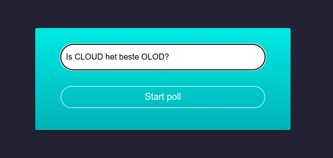
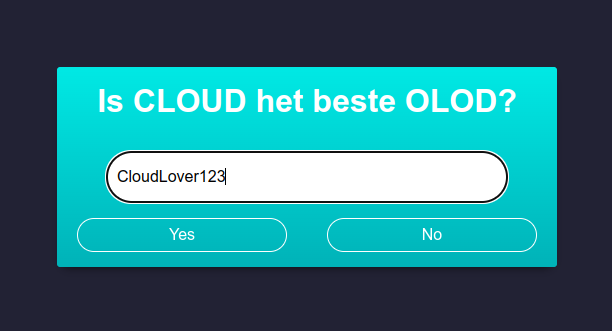
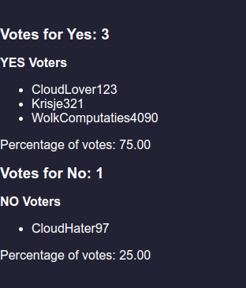

# pollapp_nodejs_websocket_docker

## Launch Poll App
Run `launch_pollapp.sh`  

## Consumatie stappen
* Open een instantie van [client.html](./src/client.html)  
* Creëer een poll door een Ja/Nee-vraag in te vullen.    
  
* Vanaf nu kan je meerdere instanties van [client.html](./src/client.html) openen om te stemmen op de poll. (Naam invullen is optioneel.)  

* Na elke vote wordt het scoreboard geüpdate op elke client  

## Technologies
* JavaScript 
* WebSocket
* HTML/CSS
* Docker
